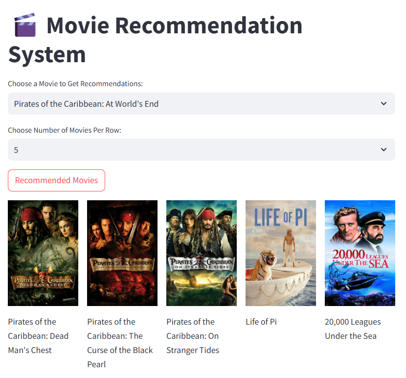

# 🎬 Movie Recommendation System

This is a **Movie Recommendation System** built using **Streamlit**. It allows users to select a movie and get personalized recommendations along with movie posters. Users can also configure the display to view a specific number of movies per row.

---

## 📚 Table of Contents  
- ✨ **[Features](#-features)**  
- 🛠️ **[Installation and Setup](#-installation-and-setup)**  
- 🚀 **[How to Run the Project](#-how-to-run-the-project)**  
- 📂 **[File Structure](#-file-structure)**  
- 🖼️ **[Screenshot](#-screenshot-example-ui)**  
- 📋 **[How to Use the App](#-how-to-use-the-app)**  
- 💡 **[Key Functions Explained](#-key-functions-explained)**  
- 🛠️ **[Dependencies](#-dependencies)**  
- 🌟 **[Credits](#-credits)**  
- ❓ **[FAQ](#-faq)**  
- 📧 **[Contact](#-contact)**  

---

## ✨ Features

- Personalized movie recommendations based on similarity.
- Fetches and displays movie posters.
- User-configurable layout to display movies in rows (1 to 10 movies per row).
- Simple and interactive user interface.

---

## 🛠️ Installation and Setup

Follow these steps to set up and run the project on your local machine:

### 1. Clone the Repository
```bash
git clone https://github.com/your-username/movie-recommendation-system.git
cd movie-recommendation-system
```

### 2. Install Python
Ensure Python (version 3.8 or higher) is installed. You can download Python from [python.org](https://www.python.org/).

### 3. Create a Virtual Environment (Optional but Recommended)
```bash
python -m venv env
source env/bin/activate  # For Linux/Mac
env\Scripts\activate     # For Windows
```

### 4. Install Required Packages
Install the required Python libraries using pip:
```bash
pip install streamlit pandas requests
```

### 5. Add Required Files
- **movie_dict.pkl**: Add this file containing the movie dataset.
- **similarity_distance.pkl**: Add this file containing the similarity matrix.

Place these files in the root directory of your project.

---

## 🚀 How to Run the Project

1. Open a terminal in the project directory.
2. Run the Streamlit app:
   ```bash
   streamlit run app.py
   ```
3. Open the displayed local URL (e.g., `http://localhost:8501`) in your web browser.

---

## 📂 File Structure
```
movie-recommendation-system/
│
├── app.py                  # Main Streamlit application
├── movie_dict.pkl          # Dataset of movies
├── similarity_distance.pkl # Precomputed similarity matrix
├── README.md               # Project documentation
```

---

## 🖼️ Screenshot (Example UI)



---

## 📋 How to Use the App

1. **Select a Movie**: Choose a movie from the dropdown list.
2. **Set Display Preferences**: Choose how many movies you want to display in each row.
3. **Get Recommendations**: Click the "Recommend" button to view recommendations.

---

## 💡 Key Functions Explained

### `fetchPoster(movie_id)`
- Fetches the movie poster using the TMDb API.
- If a poster is unavailable, displays a placeholder image.

### `Recommended(movie, similarity_distance)`
- Computes recommendations based on the similarity matrix.
- Returns the top 10 similar movies and their posters.

---

## 🛠️ Dependencies
- **Streamlit**: For building the web interface.
- **Pandas**: For handling movie data.
- **Requests**: For fetching data from the TMDb API.

---

## 🌟 Credits

- **The Movie Database (TMDb)**: For movie data and posters.
- **Streamlit**: For creating the interactive user interface.

---

## ❓ FAQ

### What is `movie_dict.pkl`?
This is a pickle file containing the movie dataset, including movie titles and their IDs.

### What is `similarity_distance.pkl`?
This is a precomputed matrix containing similarity scores for all movies in the dataset.

---

## 📧 Contact
For any questions or feedback, feel free to reach out:
- Email: ranjeetkumar4261770@gmail.com
- GitHub: [ranjeet5555](https://github.com/ranjeet5555)
